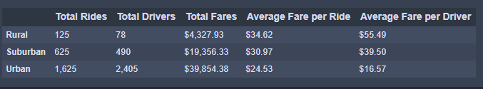

# PyBer_Analysis

## Overview of Analysis
The new PyBer Analysis, requested by our ficitonal boss V. Izualize, was a test of our knowledge of Python, Pandas, and MatPlotLib. Our goal was to create a summary DataFrame of the ride-sharing data by city type, then create a multi-line graph to show weekly fares for each city type. This analysis will be used to compare city types with information on rides, drivers and fares. We will then talk about how we might use that information to improve our business. 

## Results
To begin the discussion I would like to bring up a DataFrame of information split up by City Type.

    

The table is broken down by city types, which are Rural, Suburban, and Urban, and display the total rides, drivers, and fares for each type. It also displays the Average Fare per Ride, and per Driver. The first thing you notice about this data is that Urban usage of the app is higher than the other types. Urban communities are more populated, so therefore they have more potential drivers and customers. This also leads to a higher total fare. However, you will notice that the Average Fare per Ride is lower than the other city types. This is because customers in Urban cities are likely traveling a shorter distance to their destination (which we can assume is also within the Urban city), which draws our Average Fare per Ride down. This also reflects onto our Average Fare per Driver metric, which is also lower than the other city types. It is also important to note that Urban areas have more Total Drivers than Total Rides. This explains why the Average Fare per Driver is lower than the Average Fare per Ride in Urban areas.

When it comes to the Suburban and Rural city types, there are less total rides and drivers, leading to a low amount of fares. However, the Average Fare per Ride and per Driver are higher than in Urban areas. This is the inverse of the Urban area's explanation, as customers in Rural and Suburban city types are likely traveling further to their destinations. This allows our averages to be brought up.

The next piece of data to look at would be a graph showing the Weekly Fares for each City Type. 

    

The graph shows each city type broken into their own line, showing their return in $USD over the period of January 1st, 2019 and April 29th, 2019. The lines are very steady, with the Urban city type clearly bringing in the most money per week, followed by suburban, and then rural. Despite having low averages, the Urban city type continues to earn the most money per week, due to the higher population of customers using the app. Looking back to the table above, we can see that the number of total rides in Urban areas is more than double the total rides of the other two city types combined. 

## Summary
Based on the results of the analysis, we can make three recommendations into expanding business for PyBer. First, we can see that Urban areas dominate when it comes to Total Fares. So I would recommend continuing to boost that market by marketing and creating promotions for users in Urban areas, such as offering discounts to consistant users. The fact that Urban aras have more Total Drivers than Total Rides means that there are still more customers to be found. Next, I would concentrating marketing into the other two city types in order to grow the customer base there. Of course it will never match the population of Urban centers, but if Suburban and Rural areas can increase their customer base while maintaining the Average Price per Ride, it will reflect well on Total Fares. Thirdly, I would also consider offering discounts on rides longer than a certain distance. In Rural and Suburban areas, customers are likely traveling further to reach their destination. It might boost usage in these areas if the rates are decreased past a certain distance. 